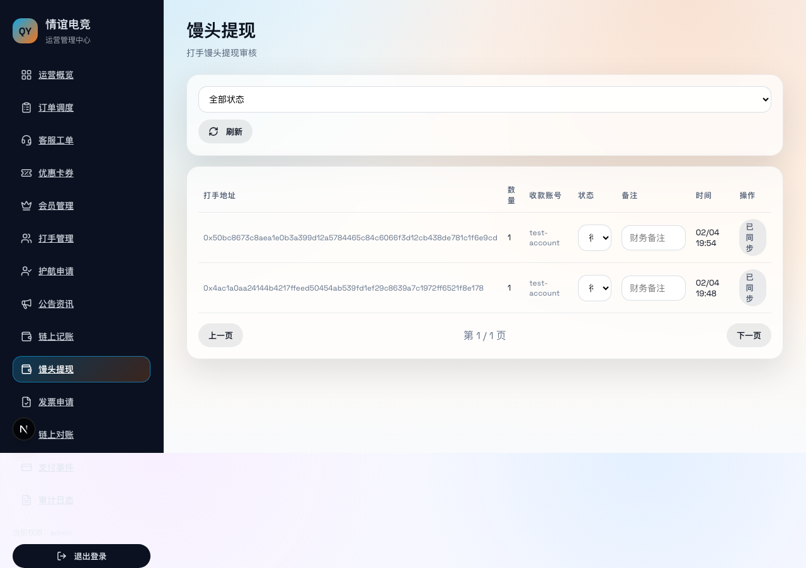
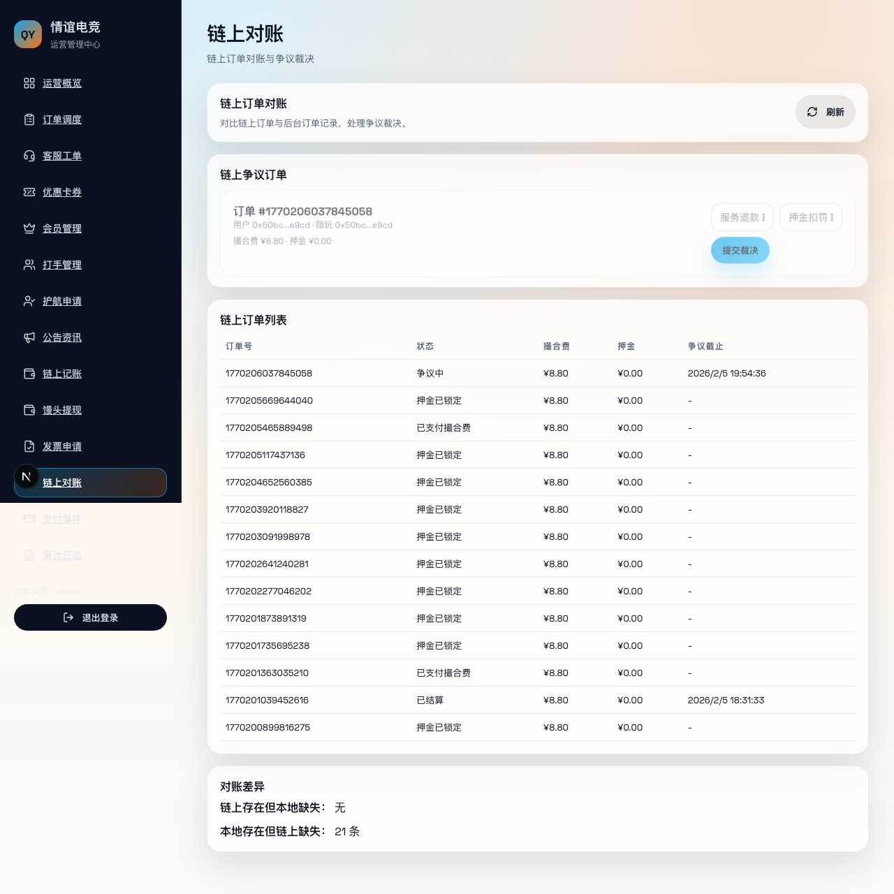

# 情谊电竞后台人工流程指南（默认路径）

> 说明：本指南描述「后台人工处理」的默认路径，适用于争议裁决与订单对账的人工流程演示与测试。

## 0. 前置条件
- 后台可访问（本地或测试环境）。
- 已配置后台登录 Token（如 `ADMIN_DASH_TOKEN`）。
- 前台已产生至少 1 笔可裁决/可对账的链上订单。

---

## 1. 登录后台
进入后台入口，使用管理员 Token 登录。

要点：
- 建议使用 `ADMIN_DASH_TOKEN` 登录。
- 登录后确保能看到后台首页或侧边栏菜单。

---

## 2. 进入链上对账/争议列表
从侧边栏进入「链上对账」或「争议订单」列表。

要点：
- 默认路径：`后台 → 链上对账`
- 列表中应可看到订单号、状态、更新时间等信息。

---

## 3. 馒头提现审核
从侧边栏进入「馒头提现」，查看待审核申请并更新状态。

要点：
- 待审核 → 已通过 → 已打款，或 → 已拒绝/已退回。
- 可填写财务备注，便于对账与跟踪。

---

## 4. 定位待裁决订单
找到状态为“争议中”的订单，点击进入详情或操作面板。

要点：
- 订单号应与前台争议订单一致。
- 争议信息（用户填写说明）应可见。

---

## 5. 提交裁决（默认人工路径）
填写裁决参数并提交：
- 服务退款比例（给用户）
- 押金扣罚比例（给陪玩/平台）

要点：
- 默认路径为“人工裁决后提交上链”。
- 提交成功后状态应变为“已结算”。

---

## 6. 回查状态
回到列表或详情页刷新，确认订单状态已更新为“已结算”。

要点：
- 前台「展示」页也应能看到状态同步。
- 如状态不更新，可等待链上事件同步或手动刷新。

---

## 测试清单（人工路径）
- 登录后台成功
- 看到争议订单列表
- 进入订单详情/裁决面板
- 提交裁决成功（有成功提示或链上确认）
- 订单状态更新为“已结算”

---

## 备注
- 本指南为“默认人工路径”，若后续需要自动裁决或策略引擎版本，可另出版本指南。
- 截图复用前台全流程的后台裁决截图：`docs/assets/user-flow/10-admin-dispute.png`
- 前台陪玩接单后可查看用户游戏名/ID（对应用户流程第 7 步截图）。
