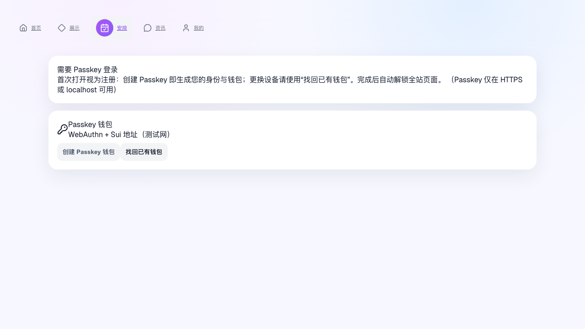
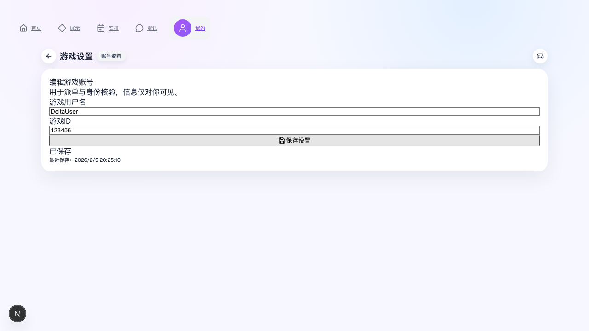
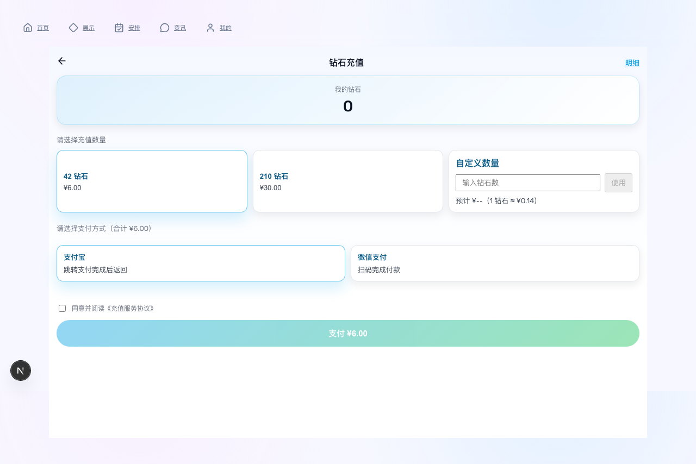
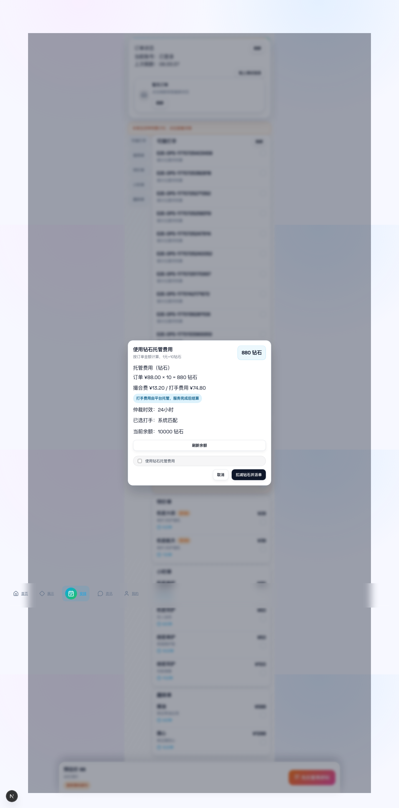
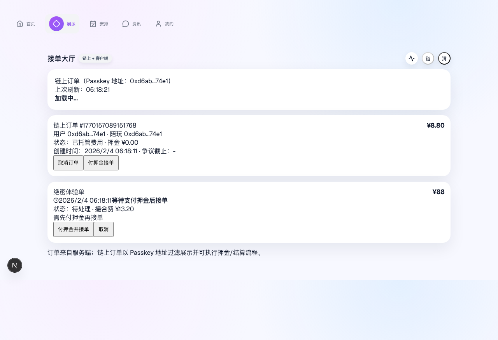
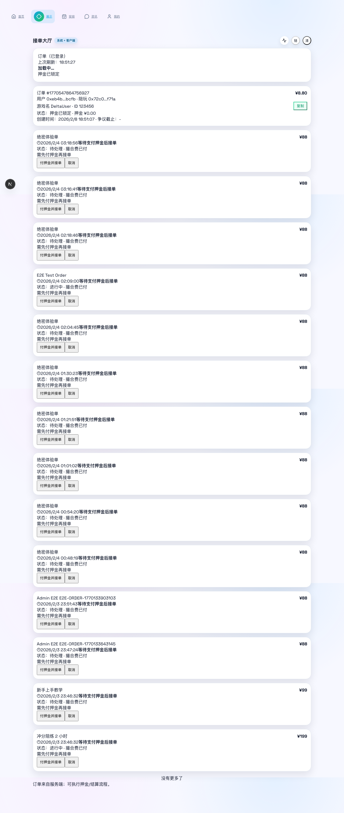
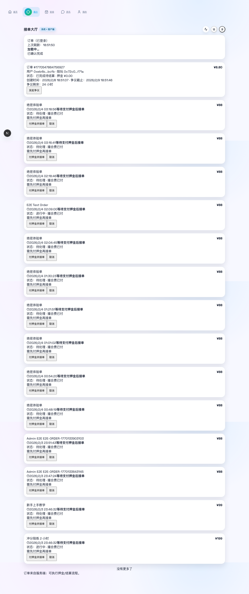
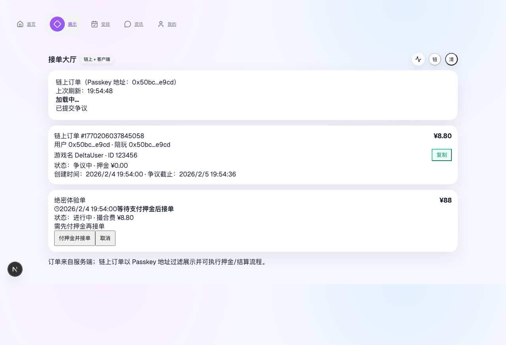
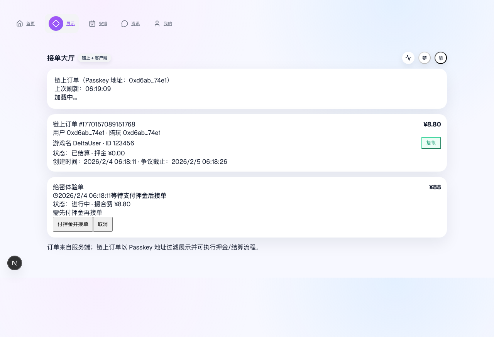
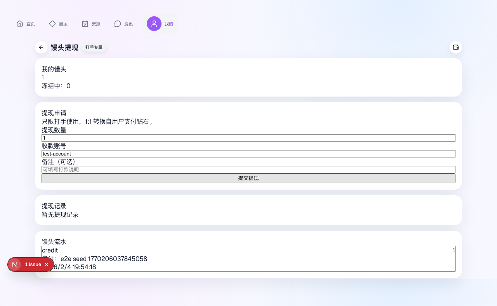

# 情谊电竞用户全流程使用指南（链上版本）

> 说明：本流程为“前端触发的真人操作模拟”，同一个 Passkey 地址同时扮演用户与陪玩（仅用于演示/测试）。
> 录屏与截图来自最近一次链上 E2E 流程执行，时间：2026-02-04。

## 0. 前置条件
- 浏览器环境支持 Passkey（HTTPS 或 localhost）。
- 已配置链上环境（`NEXT_PUBLIC_CHAIN_ORDERS=1`）。
- 具备链上测试资金（Sui Testnet）。

---

## 1. Passkey 注册/登录
首次进入系统，点击 Passkey 登录按钮创建钱包并登录。

要点：
- 首次登录即创建 Passkey 地址。
- 成功后会解锁全站功能。

---

## 2. 游戏设置（填写游戏名与ID）
进入「我的」页，点击设置进入「游戏设置」，填写三角洲游戏名与游戏ID并保存。

要点：
- 该信息用于下单时的游戏身份匹配。
- 当前数据保存于本地（以 Passkey 地址区分）。

---

## 3. 钻石充值
进入「钱包」页选择充值数量并完成支付，回到页面自动刷新余额。

要点：
- 余额不足时，安排页会引导跳转到充值页。
- 充值完成后建议下拉刷新或等待自动刷新提示。

---

## 4. 选择服务并打开托管弹窗
进入「安排」页，选择服务后点击「先托管再呼叫」。

要点：
- 这是用户发起订单入口。
- 会进入托管费用确认弹窗。

---

## 5. 托管费用并创建链上订单
勾选“使用钻石托管费用”，点击“扣减钻石并派单”。

要点：
- 扣减钻石成功后自动创建链上订单。
- 前端进入“派单中”状态。

---

## 6. 链上订单状态检查
切换到「展示」页，点击“刷新链上订单”查看订单状态（页面每 30 秒自动刷新一次，并显示上次刷新时间）。

要点：
- 链上订单会显示订单号与状态。
- 初始状态为“已托管费用”。

---

## 7. 打手接单（付押金）
由陪玩（演示中为同一 Passkey 地址）点击“付押金接单”（会弹出二次确认）。

要点：
- 成功后订单状态变为“押金已锁定”。
- 表示陪玩已接单。
- 接单后可看到用户的游戏名与ID，并支持一键复制。

---

## 8. 用户确认完成
用户点击“确认完成”（会弹出二次确认），订单进入待结算状态。

要点：
- 成功后状态为“已完成待结算”。
- 进入争议/结算窗口期。

---

## 9. 发起争议
用户点击“发起争议”并填写争议说明（弹窗提交）。

要点：
- 状态变为“争议中”。
- 需要后台裁决。

---

## 10. 后台裁决
进入后台「链上对账」，找到争议订单并提交裁决。

要点：
- 可输入服务退款 / 押金扣罚比例。
- 提交后链上执行裁决。

---

## 11. 结算完成
回到前台刷新链上订单，状态变为“已结算”。

要点：
- 订单生命周期结束。
- 资金结算完成。

---

## 12. 打手馒头提现
陪玩在「我的」页进入「馒头提现」，查看余额并提交提现申请。

要点：
- 馒头由用户支付钻石 1:1 自动转换，仅打手可见。
- 提现申请提交后进入后台审核流程。

---

## 附录：录屏与测试产物
- 录屏：`test-results/chain.e2e-chain-e2e-passke-f7a0b-and-resolves-order-on-chain-Chain-E2E---Chromium/video.webm`
- 自动截图：`docs/assets/user-flow/*.png`

## 备注
- 本指南是“链上流程”版本；如需“非链上版本”，可另出一份。
- 当前演示用同一 Passkey 地址扮演用户与陪玩，仅用于测试流程打通。
